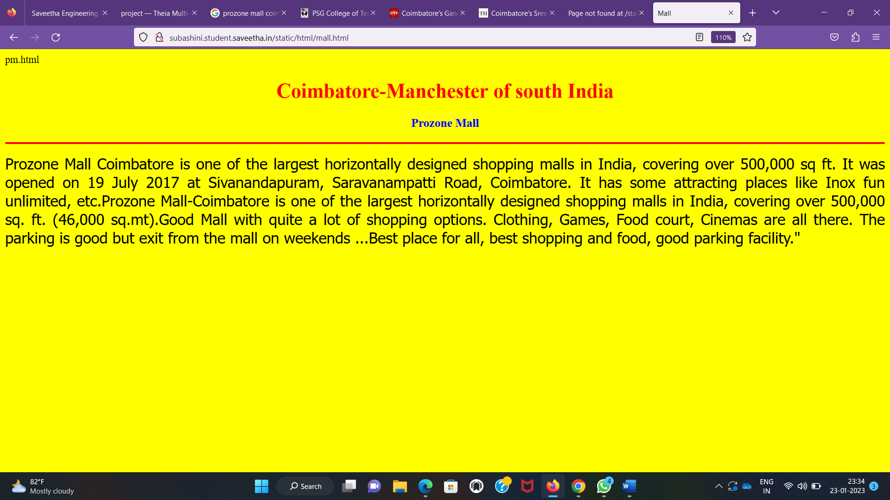

# Places Around Me
## AIM:
To develop a website to display details about the places around my house.

## Design Steps:

### Step 1:
Clone the github repository into Theia IDE.

### Step 2:
Create a new Django project

### Step 3:
Write the needed HTML code.

### Step 4:
Run the Django server and execute the HTML files.

## Code:
```
map.html


<!DOCTYPE html>
<html lang="en">
<head>
<title>My City</title>
</head>
<body>
<h1 align="center">
<font color="red"><b>Coimbatore_Manchester of South India</b></font>
</h1>
<h3 align="center">
<font color="blue"><b>Subashini.S(22009344)</b></font>
</h3>
<center>

<map name="MyCity">
<area shape="circle" coords="190,50,20" href="/static/html/cia.html" title="Coimbatore.International Airport">
<area shape="rectangle" coords="230,30,260,60" href="/static/html/pm.html" title="Prozone Mall">
<area shape="circle" coords="400,350,50" href="/static/html/psgct.html" title="PSG college of Technology">
<area shape="circle" coords="400,200,75" href="/static/html/gh.html" title="Ganga Hospital">
<area shape="rectangle" coords="490,150,870,320" href="/static/html/sa.html" title="Sree Annapoorna">
</map>
</center>
</body>
</html>


cia.html

<!DOCTYPE html>
<html lang="en">
<head>
<title>Airport</title>
</head>
<body bgcolor="cyan">
<h1 align="center">
<font color="red"><b>Coimbatore-Manchester 0f South India</b></font>
</h1>
<h3 align="center">
<font color="blue"><b>Coimbatore.International Airport</b></font>
</h3>
<hr size="3" color="red">
<p align="justify">
<font face="Courier New" size="5">
<b>
Coimbatore International Airport[5] (IATA: CJB, ICAO: VOCB) is an international airport and the primary airport serving the industrial cities of Coimbatore and Tiruppur in Tamil Nadu, India. It is located in the neighbourhood of Peelamedu, about 10 km (6.2 mi) from Coimbatore's city centre. It is the 18th-busiest airport in India for passengers handled, 17th-busiest for total aircraft movement and 15th-busiest for cargo handled. It is the second busiest airport in Tamil Nadu in terms of total passenger traffic after Chennai International Airport.[citation needed] The airport is served by five Indian and three foreign carriers providing direct connectivity to nine domestic and three international destinations.
</b>
</font>
</p>
</body>
</html>

mall.html

<!DOCTYPE html>
<html lang="en">
<head>
<title>Mall</title>
</head>
<body bgcolor="yellow">
<h1 align="center">
<font color="red"><b>Coimbatore-Manchester of south India</b></font>
</h1>
<h3 align="center">
<font color="blue"><b>Prozone Mall</b></font>
</h3>
<hr size="3" color="red">
<p align="justify">
<font face="Tahoma" size="5">
Prozone Mall Coimbatore is one of the largest horizontally designed shopping malls in India, covering over 500,000 sq ft. It was opened on 19 July 2017 at Sivanandapuram, Saravanampatti Road, Coimbatore. It has some attracting places like Inox fun unlimited, etc.Prozone Mall-Coimbatore is one of the largest horizontally designed shopping malls in India, covering over 500,000 sq. ft. (46,000 sq.mt).Good Mall with quite a lot of shopping options. Clothing, Games, Food court, Cinemas are all there. The parking is good but exit from the mall on weekends ...Best place for all, best shopping and food, good parking facility."
</font>
</p>
</body>
</html>

psgct.html
<!DOCTYPE html>
<html lang="en">
<head>
<title>Engineering college</title>
</head>
<body bgcolor="pink">
<h1 align="center">
<font color="red"><b>Coimbatore-Manchester of South India</b></font>
</h1>
<h3 align="center">
<font color="blue"><b>PSG college of Technology</b></font>
</h3>
<hr size="3" color="red">
<p align="justify">
<font face="Arial" size="5">
<b>
PSG College of Technology is an autonomous, government aided, private engineering college in Coimbatore, India. It is affiliated with Anna University. It is affiliated to PSG and Sons Charities Trust.PSG College of Technology is an autonomous, government aided, private engineering college in Coimbatore, India. It is affiliated with Anna University. It is affiliated to PSG and Sons Charities Trust.PSG College of Technology is an autonomous, government aided, private engineering college in Coimbatore, India. It is affiliated with Anna University. It is affiliated to PSG and Sons Charities Trust.
</b>
</font>
</p>
</body>
</html>

gh.html
<!DOCTYPE html>
<html lang="en">
<head>
<title>Hospital</title>
</head>
<body bgcolor="lime">
<h1 align="center">
<font color="red"><b>Coimbatore-Manchester of South India</b></font>
</h1>
<h3 align="center">
<font color="blue"><b>Ganga hospital</b></font>
</h3>
<hr size="3" color="red">
<p align="justify">
<font face="Georgia" size="5">
It is to be noted that Ganga Hospital has been ranked first for the third consecutive time under this under this category.Under the overall orthopedic category,which includes both government and private category.AIIMS,New Delhi ranked first and Ganga Hospital ranked second followed by christian Medical College ans others."Several criterion including infrastucture,turnover,patient care,international presence,excellence in academic have been talking into account for this ranking.A polling from Doctors across the nation has been taken under various categories like orthopedics said Dr.S.Rajasekaran,Chairman Department of Orthopedics and spine surgery.

</font>
</p>
</body>
</html>


ah.html
<!DOCTYPE html>
<html lang="en">
<head>
<title>Restuarant</title>
</head>
<body bgcolor="orange">
<h1 align="center">
<font color="red"><b>Coimbatore-Manchester of South India </b></font>
</h1>
<h3 align="center">
<font color="blue"><b> Sree Annapoorna  </b></font>
</h3>
<hr size="3" color="red">
<p align= "justify">
<font face = "Georgia" size="5">
Sree Annapoorna is the finest group of restuarant in Coimbatore to bring you the culinary art.One of the prominent restuarant in the heart of chennai just opposite to chennai just opposite to coimbatore court and railway station.The food was good as before and the taste was standard Annapoorana taste.Parking is an issues and very difficult to find nearby.The interior was very good.Price was on higher side but justifies tastes and service.Sree Annapoorana reinvents itself with a buisness hotel and fine dining resturant,complete with jasmine cake and nannari negronics.They have South Indian,North Indian,Chinese,Beverages,Shakes dishes.
</font>
</p>
</body>
</html>
```

## Output:




## HTML Validator


## Result:
The program for implementing image map is executed successfully.